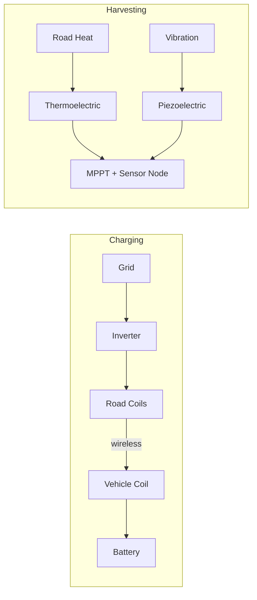
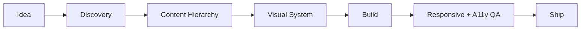
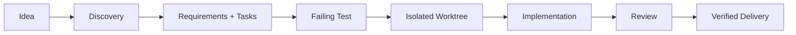

# Hi, I'm Zaheer 👋

*Computer science student who likes it when software leaves the screen — sensors, microcontrollers, AI agents, and the occasional research paper.*

---

## About me

I'm a computer science student at the University of Sialkot, based in Daska, Pakistan — about three years into writing code across a mix of academic and independent projects.

Most of that time splits between two things that don't always overlap: building web software with React and TypeScript, and building things that touch the physical world — sensors, microcontrollers, relays, the odd energy-harvesting circuit. Lately a third interest has been eating into both: AI coding agents, and specifically the scaffolding around them — skills and workflows that make an agent slow down, ask the right questions, and test what it ships instead of guessing.

I'd rather ship something small I can explain end-to-end — why it exists, who it's for, how it fails, how it's tested — than something impressive I can't. That thread runs through everything below, from a blink-controlled light switch to a plugin that makes Claude Code write tests before it writes features.

Currently reading up on distributed systems, cloud infrastructure, and cybersecurity, mostly because my IoT projects keep running into all three. Blockchain's on the list too, more out of curiosity than any concrete plan for it yet.

---

## 🧰 What I work with

A quick rundown of what I reach for most:

**Languages**

**Frontend**

**Data & tools**

**Embedded & IoT**

`Arduino` `ESP8266` `NodeMCU` `Blynk` `Sensor Integration` `Relay Control`

I also lean on test-driven development, isolated Git worktrees, and lately my own AI coding agent skills — plus IEEE-style technical writing in LaTeX and Overleaf for the research side.

---

## 🚀 Things I've built

Six projects that span both sides of what I do — web software, physical systems, and lately a couple of tools for AI agents themselves.

### 👁️ Eye-Blink Smart Home

A hands-free home automation setup built on a simple idea: your blink is a switch. Wearable infrared sensors pick up intentional blinks, a NodeMCU ESP8266 tells them apart from ordinary ones, and relays take it from there to control connected appliances. It's built to keep working locally without depending on the cloud, with Blynk layered on top for optional remote monitoring — designed with users who have limited mobility in mind.

`ESP8266` `NodeMCU` `Arduino` `C++` `TCRT5000` `Relay Control` `Blynk`

### ⚡ EV Energy Harvesting

A research concept for roads that do more than sit there: charging electric vehicles as they drive over resonant inductive coils, while also pulling extra power out of the road itself — heat through thermoelectric generators, vibration through piezoelectric elements. The write-up focuses on coupling efficiency, alignment tolerance, and how the harvested energy could realistically feed a roadside sensor network.

See the architecture

`EV Systems` `Wireless Power` `Resonant Coupling` `Thermoelectric` `Piezoelectric` `LaTeX`

### 💸 Expense Management System

A personal finance dashboard for everyday spending, built in React and TypeScript — categorized transactions, budgets, monthly summaries, and charts that make the numbers legible at a glance. It's a full CRUD app with a responsive UI, aimed more at being genuinely usable than feature-stacked.

`React` `TypeScript` `Dashboard UI` `Charts` `CRUD` `Responsive Design`

*Repo:* [`Zaheer-verse/expense-management-system`](https://github.com/Zaheer-verse/expense-management-system)

### 🧩 DesignForge

An open-source skill that stops AI coding agents from jumping straight to code. Before a single component gets written, it walks the agent through product discovery, content hierarchy, and an actual visual system, then checks the result against responsiveness, accessibility — contrast, focus states, keyboard navigation, reduced motion — and deployment readiness.

See the workflow

`AI Agents` `UI/UX` `Accessibility` `Python` `Open Source`

*Repo:* [`Zaheer-verse/DesignForge`](https://github.com/Zaheer-verse/DesignForge)

### 🧪 Deliberate Dev · Codex

A structured delivery workflow for Codex that treats "build this feature" as more than one big prompt. It clarifies what's actually being asked for, breaks it into small tasks with acceptance criteria, writes the failing test before any implementation, works each task in its own isolated Git worktree, and won't call something done without a security and correctness review plus real execution evidence.

See the pipeline

`Codex` `Python` `TDD` `Git Worktrees` `QA` `Security`

*Repo:* [`Zaheer-verse/deliberate-dev-codex`](https://github.com/Zaheer-verse/deliberate-dev-codex)

### 🔁 Deliberate Dev · Claude Code

The same discipline, rebuilt as a native Claude Code plugin: a main workflow coordinator, six specialized engineering skills, and namespaced commands that take a vague request through discovery, planning, isolated test-first implementation, review, and verification, with blockers reported explicitly instead of quietly skipped. Distributed through the GitHub Marketplace.

See the workflow

`Claude Code` `AI Agents` `Python` `Git Worktrees` `TDD` `QA`

*Repo:* [`Zaheer-verse/deliberate-dev-claude`](https://github.com/Zaheer-verse/deliberate-dev-claude)

---

## 📌 A few repos worth a look

If you want to poke at the code directly, these are the ones I'd point you to first.

---

## 📊 GitHub activity

The numbers, for what they're worth:

 

---

## ✉️ Get in touch

I'm always up for talking about AI developer tools, IoT and assistive tech, EV or energy research, or open source in general — if any of that overlaps with what you're building, I'd like to hear about it.

The quickest way to reach me is by [email](mailto:zaheery991@gmail.com), or on [WhatsApp](https://wa.me/923335398292) if that's easier.

*"Ideas become valuable when they survive the journey from imagination to implementation."*

