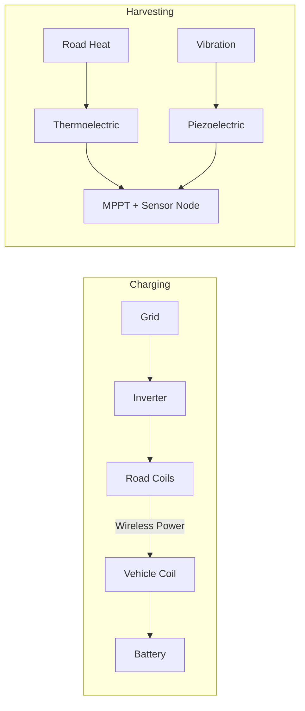
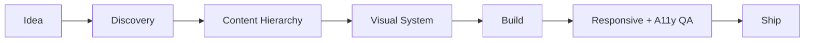
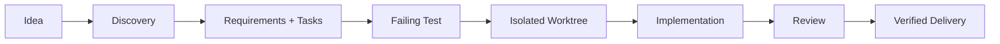
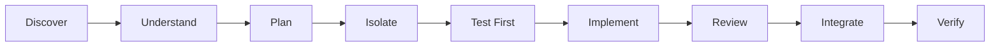

from pathlib import Path
import html, textwrap, zipfile, re

outdir = Path("/mnt/data/zaheer-verse-github-profile")
outdir.mkdir(exist_ok=True)

# ---------------------------
# README.md
# ---------------------------
readme = r'''<div align="center">

<picture>
  <source media="(prefers-color-scheme: dark)" srcset="./dark.svg">
  <source media="(prefers-color-scheme: light)" srcset="./light.svg">
  
</picture>

<br/>

<a href="https://zaheer-verse.vercel.app/">
  
</a>
<a href="https://www.linkedin.com/in/zaheer-yousaf">
  
</a>
<a href="https://github.com/Zaheer-verse">
  
</a>
<a href="mailto:zaheery991@gmail.com">
  
</a>

</div>

---

## `ABOUT.ME`

```bash
zaheer@verse:~$ whoami

Name       : Zaheer Yousaf
Education  : BS Computer Science — University of Sialkot
Location   : Daska, Sialkot, Pakistan
Focus      : IoT · Web Engineering · AI Developer Tools · EV & Energy Research
Status     : Building, learning, testing, improving
```

I’m a **Computer Science student** who likes building practical systems across software, hardware, automation, and research.

My work moves between **web applications**, **IoT and embedded systems**, **AI-assisted engineering workflows**, and **energy-focused research concepts**. I prefer projects that I can understand end-to-end: what problem they solve, how the system works, where it can fail, and how the result can be tested.

Recently, I’ve also been exploring how AI coding agents can work more deliberately — clarifying requirements, breaking tasks into smaller units, writing tests before implementation, working in isolated Git worktrees, reviewing changes, and verifying the final result.

---

## `CURRENT.FOCUS`

```text
01  IoT & Embedded Systems
02  AI Coding Agents & Developer Workflows
03  React / TypeScript Web Applications
04  EV Wireless Charging & Road Energy Harvesting
05  Distributed Systems · Cloud · Cybersecurity
```

---

## `ENGINEERING.STACK`

### `LANGUAGES`

<p>
  
</p>

`C` `C++` `Python` `JavaScript` `TypeScript` `HTML` `CSS`

### `WEB`

<p>
  
</p>

`React` `Vite` `Tailwind CSS` `Node.js` `Responsive UI`

### `DATABASES & TOOLS`

<p>
  
</p>

`MongoDB` `MySQL` `Git` `GitHub` `VS Code` `Vercel`

### `EMBEDDED & IoT`

`ESP8266` `NodeMCU` `Arduino` `Blynk` `TCRT5000` `Sensor Integration` `Relay Control`

### `WORKFLOW`

`Test-Driven Development` `Git Worktrees` `QA` `Security Review` `AI Agent Skills` `LaTeX` `Overleaf`

---

## `FEATURED.PROJECTS`

### `01 // Eye-Blink Smart Home`


A hands-free smart-home system where intentional eye blinks act as controls for connected appliances. Infrared sensors detect blink input, a **NodeMCU ESP8266** processes the interaction, relays control appliances, and **Blynk** provides optional remote monitoring.

`ESP8266` `NodeMCU` `C++` `TCRT5000` `Relay Control` `Blynk`

---

### `02 // EV Energy Harvesting`


A research concept combining **dynamic wireless EV charging** with road-based energy harvesting through thermoelectric and piezoelectric systems.

<details>
<summary><strong>Open system architecture</strong></summary>


```mermaid
flowchart LR
    subgraph Charging
        A[Grid] --> B[Inverter] --> C[Road Coils]
        C -->|Wireless Power| D[Vehicle Coil] --> E[Battery]
    end

    subgraph Harvesting
        F[Road Heat] --> G[Thermoelectric]
        H[Vibration] --> I[Piezoelectric]
        G --> J[MPPT + Sensor Node]
        I --> J
    end
```

</details>

`EV Systems` `Wireless Power` `Resonant Coupling` `Thermoelectric` `Piezoelectric` `LaTeX`

---

### `03 // Expense Management System`


A responsive personal-finance dashboard built with **React and TypeScript** for categorized transactions, budgets, monthly summaries, CRUD workflows, and visual spending insights.

`React` `TypeScript` `Dashboard UI` `Charts` `CRUD` `Responsive Design`

**Repository →** [Zaheer-verse/expense-management-system](https://github.com/Zaheer-verse/expense-management-system)

---

### `04 // DesignForge`


An open-source workflow skill designed to stop AI coding agents from jumping directly into code. It guides the agent through discovery, content hierarchy, visual-system planning, implementation, responsive checks, accessibility review, and deployment readiness.

<details>
<summary><strong>Open workflow</strong></summary>


```mermaid
flowchart LR
    A[Idea] --> B[Discovery]
    B --> C[Content Hierarchy]
    C --> D[Visual System]
    D --> E[Build]
    E --> F[Responsive + A11y QA]
    F --> G[Ship]
```

</details>

`AI Agents` `UI/UX` `Accessibility` `Python` `Open Source`

**Repository →** [Zaheer-verse/DesignForge](https://github.com/Zaheer-verse/DesignForge)

---

### `05 // Deliberate Dev · Codex`


A structured development workflow for Codex that turns a feature request into a deliberate engineering pipeline: discovery, requirements, task splitting, failing tests, isolated worktrees, implementation, review, and verified delivery.

<details>
<summary><strong>Open pipeline</strong></summary>


```mermaid
flowchart LR
    A[Idea] --> B[Discovery]
    B --> C[Requirements + Tasks]
    C --> D[Failing Test]
    D --> E[Isolated Worktree]
    E --> F[Implementation]
    F --> G[Review]
    G --> H[Verified Delivery]
```

</details>

`Codex` `Python` `TDD` `Git Worktrees` `QA` `Security`

**Repository →** [Zaheer-verse/deliberate-dev-codex](https://github.com/Zaheer-verse/deliberate-dev-codex)

---

### `06 // Deliberate Dev · Claude Code`


A Claude Code plugin built around the same structured engineering discipline: understand the request, plan it, isolate work, test first, implement, review, integrate, and verify.

<details>
<summary><strong>Open workflow</strong></summary>


```mermaid
flowchart LR
    A[Discover] --> B[Understand]
    B --> C[Plan]
    C --> D[Isolate]
    D --> E[Test First]
    E --> F[Implement]
    F --> G[Review]
    G --> H[Integrate]
    H --> I[Verify]
```

</details>

`Claude Code` `AI Agents` `Python` `Git Worktrees` `TDD` `QA`

**Repository →** [Zaheer-verse/deliberate-dev-claude](https://github.com/Zaheer-verse/deliberate-dev-claude)

---

## `REPOSITORY.INDEX`

<div align="center">

<a href="https://github.com/Zaheer-verse/deliberate-dev-codex">
  
</a>

<a href="https://github.com/Zaheer-verse/deliberate-dev-claude">
  
</a>

<a href="https://github.com/Zaheer-verse/DesignForge">
  
</a>

<a href="https://github.com/Zaheer-verse/expense-management-system">
  
</a>

<a href="https://github.com/Zaheer-verse/zaheer-verse">
  
</a>

<a href="https://github.com/Zaheer-verse/Zam-zam-pizza">
  
</a>

</div>

---

## `GITHUB.ACTIVITY`

<div align="center">


<br/><br/>


<br/><br/>


</div>

---

## `LEARNING.LOG`

```text
> Distributed Systems
> Cloud Infrastructure
> Cybersecurity
> AI-Assisted Software Engineering
> Embedded Systems
```

The goal is simple: keep turning classroom knowledge and independent learning into projects that can be built, tested, demonstrated, and improved.

---

## `CONNECT`

```bash
zaheer@verse:~$ ./connect.sh

Portfolio  -> zaheer-verse.vercel.app
GitHub     -> github.com/Zaheer-verse
LinkedIn   -> linkedin.com/in/zaheer-yousaf
Email      -> zaheery991@gmail.com
```

<div align="center">

<a href="https://zaheer-verse.vercel.app/">
  
</a>
<a href="https://github.com/Zaheer-verse">
  
</a>
<a href="https://www.linkedin.com/in/zaheer-yousaf">
  
</a>
<a href="mailto:zaheery991@gmail.com">
  
</a>

<br/><br/>

**“Ideas become valuable when they survive the journey from imagination to implementation.”**

<sub>Computer Science · IoT · Web Engineering · AI Developer Tools · Energy Research</sub>

</div>
'''
(outdir / "README.md").write_text(readme, encoding="utf-8")

# ---------------------------
# SVG generator
# ---------------------------
def make_svg(theme="dark"):
    dark = theme == "dark"
    bg0 = "#030712" if dark else "#FFFFFF"
    bg1 = "#07111F" if dark else "#F8FAFC"
    panel = "#0F172A" if dark else "#FFFFFF"
    panel2 = "#111827" if dark else "#F8FAFC"
    text = "#F8FAFC" if dark else "#0F172A"
    muted = "#94A3B8" if dark else "#475569"
    border = "#263247" if dark else "#CBD5E1"
    accent = "#22D3EE" if dark else "#0891B2"
    violet = "#8B5CF6" if dark else "#7C3AED"
    green = "#10B981"
    glow = "#22D3EE" if dark else "#38BDF8"
    shadow_opacity = ".35" if dark else ".16"

    return f'''<svg xmlns="http://www.w3.org/2000/svg" width="1180" height="610" viewBox="0 0 1180 610"
 role="img" aria-label="Zaheer Yousaf — Computer Science student, IoT developer, web developer, AI developer tools builder and energy research enthusiast">
<defs>
  <linearGradient id="bg" x1="0" y1="0" x2="1" y2="1">
    <stop offset="0%" stop-color="{bg0}"/>
    <stop offset="55%" stop-color="{bg1}"/>
    <stop offset="100%" stop-color="{bg0}"/>
    <animate attributeName="x1" values="0;0.12;0" dur="14s" repeatCount="indefinite"/>
  </linearGradient>
  <linearGradient id="accent" x1="0" y1="0" x2="1" y2="0">
    <stop offset="0%" stop-color="{violet}"/>
    <stop offset="50%" stop-color="{accent}"/>
    <stop offset="100%" stop-color="{green}"/>
  </linearGradient>
  <radialGradient id="orb1">
    <stop offset="0%" stop-color="{violet}" stop-opacity="{'.22' if dark else '.12'}"/>
    <stop offset="100%" stop-color="{violet}" stop-opacity="0"/>
  </radialGradient>
  <radialGradient id="orb2">
    <stop offset="0%" stop-color="{accent}" stop-opacity="{'.18' if dark else '.10'}"/>
    <stop offset="100%" stop-color="{accent}" stop-opacity="0"/>
  </radialGradient>
  <pattern id="grid" width="28" height="28" patternUnits="userSpaceOnUse">
    <path d="M 28 0 L 0 0 0 28" fill="none" stroke="{border}" stroke-opacity="{'.18' if dark else '.30'}" stroke-width="1"/>
  </pattern>
  <filter id="shadow" x="-20%" y="-20%" width="140%" height="140%">
    <feDropShadow dx="0" dy="14" stdDeviation="18" flood-color="#000000" flood-opacity="{shadow_opacity}"/>
  </filter>
  <filter id="glow" x="-50%" y="-50%" width="200%" height="200%">
    <feGaussianBlur stdDeviation="5" result="b"/>
    <feMerge><feMergeNode in="b"/><feMergeNode in="SourceGraphic"/></feMerge>
  </filter>
  <clipPath id="frameClip"><rect x="12" y="12" width="1156" height="586" rx="26"/></clipPath>
</defs>

<rect width="1180" height="610" rx="28" fill="url(#bg)"/>
<rect x="12" y="12" width="1156" height="586" rx="26" fill="none" stroke="url(#accent)" stroke-opacity=".55" stroke-width="1.2"/>
<rect x="12" y="12" width="1156" height="586" rx="26" fill="url(#grid)" opacity=".55"/>

<circle cx="120" cy="80" r="210" fill="url(#orb1)">
  <animateTransform attributeName="transform" type="translate" values="0 0;28 16;0 0" dur="16s" repeatCount="indefinite"/>
</circle>
<circle cx="1040" cy="525" r="260" fill="url(#orb2)">
  <animateTransform attributeName="transform" type="translate" values="0 0;-24 -18;0 0" dur="18s" repeatCount="indefinite"/>
</circle>

<!-- header -->
<g font-family="ui-monospace,SFMono-Regular,Menlo,Monaco,Consolas,monospace">
  <rect x="32" y="28" width="1116" height="52" rx="14" fill="{panel}" fill-opacity="{'.62' if dark else '.78'}" stroke="{border}" stroke-opacity=".7"/>
  <circle cx="56" cy="54" r="6" fill="#EF4444"/>
  <circle cx="76" cy="54" r="6" fill="#F59E0B"/>
  <circle cx="96" cy="54" r="6" fill="#22C55E"/>
  <text x="126" y="59" fill="{muted}" font-size="14">zaheer@verse:~</text>
  <text x="1018" y="59" fill="{green}" font-size="13">[ ONLINE ]</text>
  <circle cx="1000" cy="54" r="4" fill="{green}" filter="url(#glow)">
    <animate attributeName="opacity" values=".35;1;.35" dur="2.4s" repeatCount="indefinite"/>
  </circle>

  <!-- left panel -->
  <g filter="url(#shadow)">
    <rect x="32" y="98" width="430" height="470" rx="24" fill="{panel}" fill-opacity="{'.56' if dark else '.76'}" stroke="{border}" stroke-opacity=".75"/>
  </g>
  <text x="60" y="132" fill="{accent}" font-size="13" font-weight="700" letter-spacing="2">VISUAL.MAP</text>
  <text x="60" y="158" fill="{muted}" font-size="11">identity.render / terminal-mode</text>

  <!-- terminal identity card -->
  <rect x="62" y="184" width="370" height="218" rx="18" fill="{panel2}" fill-opacity="{'.60' if dark else '.80'}" stroke="{accent}" stroke-opacity=".24"/>
  <text x="247" y="218" fill="{muted}" font-size="11" text-anchor="middle">PROFILE / ENGINEERING</text>

  <text x="247" y="290" text-anchor="middle" font-size="74" font-weight="800" fill="url(#accent)" letter-spacing="-6">ZY</text>
  <text x="247" y="322" text-anchor="middle" font-size="13" fill="{text}" font-weight="700">ZAHEER YOUSAF</text>
  <text x="247" y="347" text-anchor="middle" font-size="12" fill="{accent}">Computer Science · Builder · Research</text>

  <!-- pseudo dot matrix -->
  <g fill="{accent}" opacity=".28">
    {''.join(f'<circle cx="{86 + (i%23)*14}" cy="{370 + (i//23)*10}" r="1.15"><animate attributeName="opacity" values=".12;.55;.12" dur="{4 + (i%7)*0.35}s" repeatCount="indefinite"/></circle>' for i in range(69))}
  </g>

  <text x="62" y="438" fill="{muted}" font-size="11">~/profile $</text>
  <text x="154" y="438" fill="{green}" font-size="11">build --test --ship</text>
  <text x="62" y="470" fill="{text}" font-size="13">IoT systems + web software</text>
  <text x="62" y="494" fill="{text}" font-size="13">AI developer workflows</text>
  <text x="62" y="518" fill="{text}" font-size="13">EV &amp; energy research</text>
  <text x="62" y="546" fill="{muted}" font-size="11">Daska · Sialkot · Pakistan</text>

  <!-- right panel -->
  <g filter="url(#shadow)">
    <rect x="482" y="98" width="666" height="470" rx="24" fill="{panel}" fill-opacity="{'.58' if dark else '.80'}" stroke="{border}" stroke-opacity=".75"/>
  </g>

  <text x="516" y="132" fill="{accent}" font-size="13" font-weight="700" letter-spacing="2">SYSTEM.INFO</text>
  <text x="516" y="160" fill="{muted}" font-size="12">zaheer@verse:~$ ./profile.sh</text>

  <text x="516" y="205" fill="{muted}" font-size="11">NAME</text>
  <text x="655" y="205" fill="{text}" font-size="14" font-weight="700">Zaheer Yousaf</text>

  <text x="516" y="239" fill="{muted}" font-size="11">ROLE</text>
  <text x="655" y="239" fill="{accent}" font-size="14">Computer Science Student</text>

  <text x="516" y="273" fill="{muted}" font-size="11">EDUCATION</text>
  <text x="655" y="273" fill="{text}" font-size="14">BS Computer Science · University of Sialkot</text>

  <text x="516" y="307" fill="{muted}" font-size="11">FOCUS</text>
  <text x="655" y="307" fill="{text}" font-size="14">IoT · Web · AI Developer Tools · Energy</text>

  <text x="516" y="341" fill="{muted}" font-size="11">STACK</text>

  <!-- pills -->
  <g font-size="11">
    <rect x="655" y="321" width="70" height="26" rx="13" fill="{accent}" fill-opacity=".10" stroke="{accent}" stroke-opacity=".40"/>
    <text x="690" y="338" text-anchor="middle" fill="{accent}">C / C++</text>

    <rect x="733" y="321" width="82" height="26" rx="13" fill="{violet}" fill-opacity=".10" stroke="{violet}" stroke-opacity=".40"/>
    <text x="774" y="338" text-anchor="middle" fill="{violet}">Python</text>

    <rect x="823" y="321" width="96" height="26" rx="13" fill="{green}" fill-opacity=".10" stroke="{green}" stroke-opacity=".40"/>
    <text x="871" y="338" text-anchor="middle" fill="{green}">React / TS</text>

    <rect x="927" y="321" width="90" height="26" rx="13" fill="{accent}" fill-opacity=".10" stroke="{accent}" stroke-opacity=".40"/>
    <text x="972" y="338" text-anchor="middle" fill="{accent}">ESP8266</text>

    <rect x="1025" y="321" width="88" height="26" rx="13" fill="{violet}" fill-opacity=".10" stroke="{violet}" stroke-opacity=".40"/>
    <text x="1069" y="338" text-anchor="middle" fill="{violet}">MongoDB</text>
  </g>

  <text x="516" y="392" fill="{muted}" font-size="11">BUILDING</text>
  <text x="655" y="392" fill="{text}" font-size="13">Practical systems connecting software,</text>
  <text x="655" y="413" fill="{text}" font-size="13">hardware, automation, and research.</text>

  <text x="516" y="460" fill="{muted}" font-size="11">SELECTED.PROJECTS</text>
  <text x="655" y="460" fill="{text}" font-size="12">01  Eye-Blink Smart Home</text>
  <text x="655" y="484" fill="{text}" font-size="12">02  EV Energy Harvesting</text>
  <text x="655" y="508" fill="{text}" font-size="12">03  DesignForge · Deliberate Dev</text>

  <line x1="516" y1="532" x2="1112" y2="532" stroke="{border}" stroke-opacity=".65"/>
  <text x="516" y="553" fill="{muted}" font-size="11">github.com/Zaheer-verse</text>
  <text x="1112" y="553" fill="{green}" font-size="11" text-anchor="end">● READY</text>

  <!-- scanline -->
  <rect x="32" y="96" width="1116" height="2" fill="{glow}" opacity=".10" clip-path="url(#frameClip)">
    <animate attributeName="y" values="96;566;96" dur="10s" repeatCount="indefinite"/>
    <animate attributeName="opacity" values=".04;.16;.04" dur="10s" repeatCount="indefinite"/>
  </rect>
</g>
</svg>'''

for theme in ["dark", "light"]:
    (outdir / f"{theme}.svg").write_text(make_svg(theme), encoding="utf-8")

# Basic XML parse validation
import xml.etree.ElementTree as ET
validation = {}
for theme in ["dark", "light"]:
    try:
        ET.parse(outdir / f"{theme}.svg")
        validation[theme] = "valid XML"
    except Exception as e:
        validation[theme] = f"ERROR: {e}"

# Create ZIP
zip_path = Path("/mnt/data/zaheer-verse-github-profile.zip")
with zipfile.ZipFile(zip_path, "w", zipfile.ZIP_DEFLATED) as z:
    for name in ["README.md", "dark.svg", "light.svg"]:
        z.write(outdir / name, arcname=name)

print("Created:")
for p in [outdir/"README.md", outdir/"dark.svg", outdir/"light.svg", zip_path]:
    print(p)
print("Validation:", validation)
print("README lines:", len(readme.splitlines()))
