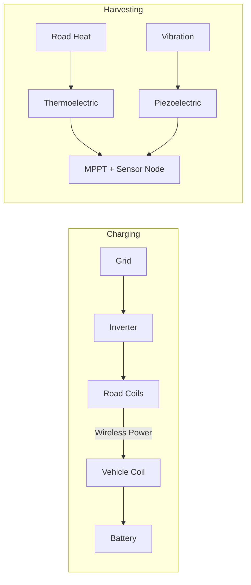
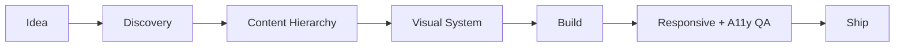
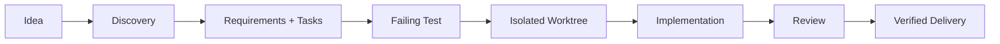
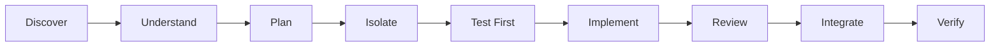

from pathlib import Path

readme = r'''<div align="center">

<!-- Premium terminal-style hero -->
<picture>
  <source media="(prefers-color-scheme: dark)" srcset="./dark.svg">
  <source media="(prefers-color-scheme: light)" srcset="./light.svg">
  
</picture>

<br/>

<a href="https://zaheer-verse.vercel.app/">
  
</a>
<a href="https://www.linkedin.com/in/zaheer-yousaf">
  
</a>
<a href="https://github.com/Zaheer-verse">
  
</a>
<a href="mailto:zaheery991@gmail.com">
  
</a>

</div>

---

## `SYSTEM.INFO`

```text
> NAME        Zaheer Yousaf
> ROLE        Computer Science Student · IoT Developer · Web Developer
> LOCATION    Daska, Sialkot, Pakistan
> EDUCATION   BS Computer Science — University of Sialkot
> FOCUS       IoT · AI Developer Tools · Web Engineering · EV & Energy Research
> BUILDING    Practical systems that connect software, hardware, automation, and research
```

I’m a **BS Computer Science student at the University of Sialkot** working across web development, IoT, embedded systems, AI-assisted software engineering, and research-driven technical projects.

My work usually sits between two worlds: **software that runs on the screen** and **systems that interact with the physical world**. I enjoy taking an idea from the first rough concept to something I can explain, test, demonstrate, and improve.

More recently, I’ve also been exploring **AI coding-agent workflows** — especially systems that make agents clarify requirements, split work into smaller tasks, write tests before implementation, use isolated Git worktrees, and verify the result before calling it complete.

---

## `CURRENT.FOCUS`

```text
[01] IoT & Embedded Systems
[02] AI Coding Agents & Developer Workflows
[03] React / TypeScript Web Applications
[04] EV Wireless Charging & Road Energy Harvesting
[05] Distributed Systems, Cloud & Cybersecurity
```

I prefer building projects with a clear purpose, understandable architecture, and enough structure that I can explain **why it exists, how it works, where it can fail, and how I would test it**.

---

## `ENGINEERING.STACK`

### Languages

<p>
  
</p>

`C` `C++` `Python` `JavaScript` `TypeScript` `HTML` `CSS`

### Frontend & Web

<p>
  
</p>

`React` `Vite` `Tailwind CSS` `Node.js` `Responsive UI`

### Databases & Development Tools

<p>
  
</p>

`MongoDB` `MySQL` `Git` `GitHub` `VS Code` `Vercel`

### Embedded & IoT

`ESP8266` `NodeMCU` `Arduino` `Blynk` `TCRT5000` `Sensor Integration` `Relay Control`

### Engineering Workflow

`Test-Driven Development` `Git Worktrees` `QA` `Security Review` `AI Agent Skills` `LaTeX` `Overleaf`

---

## `FEATURED.PROJECTS`

### `01 / Eye-Blink Smart Home`


A hands-free smart-home system where intentional eye blinks act as controls for connected appliances. Infrared sensors detect blink input, a **NodeMCU ESP8266** processes the interaction, relays control appliances, and **Blynk** provides optional remote monitoring.

The project is designed around assistive interaction and local hardware control, so the core system can continue operating without depending entirely on cloud connectivity.

`ESP8266` `NodeMCU` `Arduino` `C++` `TCRT5000` `Relay Control` `Blynk`

---

### `02 / EV Energy Harvesting`


A research concept combining **dynamic wireless EV charging** with road-based energy harvesting.

The design explores resonant inductive charging coils embedded in the road while also studying how road heat and vibration could be harvested through **thermoelectric generators** and **piezoelectric elements**.

<details>
<summary><strong>View architecture</strong></summary>


```mermaid
flowchart LR
    subgraph Charging
        A[Grid] --> B[Inverter] --> C[Road Coils]
        C -->|Wireless Power| D[Vehicle Coil] --> E[Battery]
    end

    subgraph Harvesting
        F[Road Heat] --> G[Thermoelectric]
        H[Vibration] --> I[Piezoelectric]
        G --> J[MPPT + Sensor Node]
        I --> J
    end
```

</details>

`EV Systems` `Wireless Power` `Resonant Coupling` `Thermoelectric` `Piezoelectric` `LaTeX`

---

### `03 / Expense Management System`


A responsive personal-finance dashboard built with **React and TypeScript** for managing categorized transactions, budgets, monthly summaries, and visual spending insights.

The project focuses on practical usability, clean CRUD workflows, and readable financial information instead of unnecessary feature overload.

`React` `TypeScript` `Dashboard UI` `Charts` `CRUD` `Responsive Design`

**Repository:** [Zaheer-verse/expense-management-system](https://github.com/Zaheer-verse/expense-management-system)

---

### `04 / DesignForge`


An open-source workflow skill for AI coding agents that pushes the agent to understand the product before immediately writing code.

It guides the agent through discovery, content hierarchy, visual-system planning, implementation, responsiveness, accessibility checks, and deployment-readiness review.

<details>
<summary><strong>View workflow</strong></summary>


```mermaid
flowchart LR
    A[Idea] --> B[Discovery]
    B --> C[Content Hierarchy]
    C --> D[Visual System]
    D --> E[Build]
    E --> F[Responsive + A11y QA]
    F --> G[Ship]
```

</details>

`AI Agents` `UI/UX` `Accessibility` `Python` `Open Source`

**Repository:** [Zaheer-verse/DesignForge](https://github.com/Zaheer-verse/DesignForge)

---

### `05 / Deliberate Dev · Codex`


A structured software-delivery workflow for Codex that turns a large feature request into a deliberate engineering pipeline.

It clarifies the request, defines smaller tasks and acceptance criteria, writes failing tests before implementation, isolates work using Git worktrees, reviews the result for correctness and security, and requires execution evidence before completion.

<details>
<summary><strong>View pipeline</strong></summary>


```mermaid
flowchart LR
    A[Idea] --> B[Discovery]
    B --> C[Requirements + Tasks]
    C --> D[Failing Test]
    D --> E[Isolated Worktree]
    E --> F[Implementation]
    F --> G[Review]
    G --> H[Verified Delivery]
```

</details>

`Codex` `Python` `TDD` `Git Worktrees` `QA` `Security`

**Repository:** [Zaheer-verse/deliberate-dev-codex](https://github.com/Zaheer-verse/deliberate-dev-codex)

---

### `06 / Deliberate Dev · Claude Code`


A Claude Code plugin that applies the same structured engineering discipline through a coordinated workflow and specialized skills.

It moves a task through discovery, planning, isolation, test-first implementation, review, integration, and verification while reporting blockers instead of silently skipping them.

<details>
<summary><strong>View workflow</strong></summary>


```mermaid
flowchart LR
    A[Discover] --> B[Understand]
    B --> C[Plan]
    C --> D[Isolate]
    D --> E[Test First]
    E --> F[Implement]
    F --> G[Review]
    G --> H[Integrate]
    H --> I[Verify]
```

</details>

`Claude Code` `AI Agents` `Python` `Git Worktrees` `TDD` `QA`

**Repository:** [Zaheer-verse/deliberate-dev-claude](https://github.com/Zaheer-verse/deliberate-dev-claude)

---

## `REPOSITORY.INDEX`

<div align="center">

<a href="https://github.com/Zaheer-verse/deliberate-dev-codex">
  
</a>

<a href="https://github.com/Zaheer-verse/deliberate-dev-claude">
  
</a>

<a href="https://github.com/Zaheer-verse/DesignForge">
  
</a>

<a href="https://github.com/Zaheer-verse/expense-management-system">
  
</a>

<a href="https://github.com/Zaheer-verse/zaheer-verse">
  
</a>

<a href="https://github.com/Zaheer-verse/Zam-zam-pizza">
  
</a>

</div>

---

## `GITHUB.ACTIVITY`

<div align="center">


<br/><br/>


<br/><br/>


</div>

---

## `LEARNING.LOG`

Right now I’m continuing to strengthen the areas that connect naturally with my projects:

`Distributed Systems` · `Cloud Infrastructure` · `Cybersecurity` · `AI-Assisted Development` · `Embedded Systems`

I also keep an eye on emerging areas such as blockchain when they connect to systems, infrastructure, or research problems I’m already exploring.

---

## `CONNECT`

```text
> PORTFOLIO   zaheer-verse.vercel.app
> GITHUB      github.com/Zaheer-verse
> LINKEDIN    linkedin.com/in/zaheer-yousaf
> EMAIL       zaheery991@gmail.com
```

<div align="center">

<a href="https://zaheer-verse.vercel.app/">
  
</a>
<a href="https://github.com/Zaheer-verse">
  
</a>
<a href="https://www.linkedin.com/in/zaheer-yousaf">
  
</a>
<a href="mailto:zaheery991@gmail.com">
  
</a>

<br/><br/>

*"Ideas become valuable when they survive the journey from imagination to implementation."*

</div>

---

<div align="center">

<sub>
Computer Science · IoT · Web Engineering · AI Developer Tools · Energy Research
</sub>

</div>
'''

out = Path("/mnt/data/Zaheer-GitHub-README.md")
out.write_text(readme, encoding="utf-8")
print(f"Created: {out}")
print(f"Lines: {len(readme.splitlines())}")
