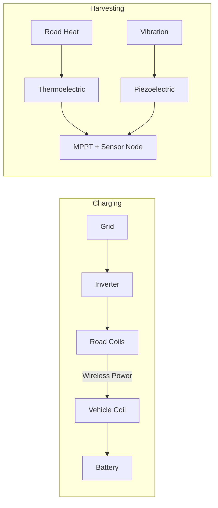
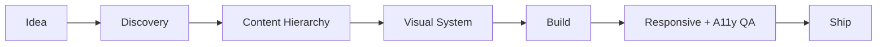
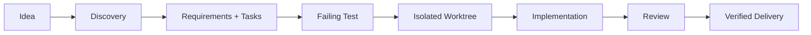
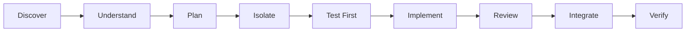

<div align="center">

<picture>
  <source media="(prefers-color-scheme: dark)" srcset="./dark.svg">
  <source media="(prefers-color-scheme: light)" srcset="./light.svg">
  
</picture>

<br/>

<a href="https://zaheer-verse.vercel.app/"></a>
<a href="https://www.linkedin.com/in/zaheer-yousaf"></a>
<a href="https://github.com/Zaheer-verse"></a>
<a href="mailto:zaheery991@gmail.com"></a>

</div>

---

## `ABOUT.ME`

```bash
zaheer@verse:~$ whoami

Name       : Zaheer Yousaf
Education  : BS Computer Science — University of Sialkot
Location   : Daska, Sialkot, Pakistan
Focus      : IoT · Web Engineering · AI Developer Tools · EV & Energy Research
Status     : Building, learning, testing, improving
```

I’m a **Computer Science student** who enjoys building practical systems across software, hardware, automation, and research.

My work moves between **web applications**, **IoT and embedded systems**, **AI-assisted engineering workflows**, and **energy-focused research concepts**. I prefer projects I can understand end-to-end: what problem they solve, how the system works, where it can fail, and how the result can be tested.

Recently, I’ve also been exploring how AI coding agents can work more deliberately — clarifying requirements, breaking work into smaller tasks, writing tests before implementation, using isolated Git worktrees, reviewing changes, and verifying the result before calling it complete.

---

## `CURRENT.FOCUS`

```text
01  IoT & Embedded Systems
02  AI Coding Agents & Developer Workflows
03  React / TypeScript Web Applications
04  EV Wireless Charging & Road Energy Harvesting
05  Distributed Systems · Cloud · Cybersecurity
```

---

## `ENGINEERING.STACK`

### `LANGUAGES`

<p>
  
</p>

`C` `C++` `Python` `JavaScript` `TypeScript` `HTML` `CSS`

### `WEB`

<p>
  
</p>

`React` `Vite` `Tailwind CSS` `Node.js` `Responsive UI`

### `DATABASES & TOOLS`

<p>
  
</p>

`MongoDB` `MySQL` `Git` `GitHub` `VS Code` `Vercel`

### `EMBEDDED & IoT`

`ESP8266` `NodeMCU` `Arduino` `Blynk` `TCRT5000` `Sensor Integration` `Relay Control`

### `WORKFLOW`

`Test-Driven Development` `Git Worktrees` `QA` `Security Review` `AI Agent Skills` `LaTeX` `Overleaf`

---

## `FEATURED.PROJECTS`

### `01 // Eye-Blink Smart Home`


A hands-free smart-home system where intentional eye blinks act as controls for connected appliances. Infrared sensors detect blink input, a **NodeMCU ESP8266** processes the interaction, relays control appliances, and **Blynk** provides optional remote monitoring.

`ESP8266` `NodeMCU` `C++` `TCRT5000` `Relay Control` `Blynk`

---

### `02 // EV Energy Harvesting`


A research concept combining **dynamic wireless EV charging** with road-based energy harvesting through thermoelectric and piezoelectric systems.

<details>
<summary><strong>Open system architecture</strong></summary>


```mermaid
flowchart LR
    subgraph Charging
        A[Grid] --> B[Inverter] --> C[Road Coils]
        C -->|Wireless Power| D[Vehicle Coil] --> E[Battery]
    end
    subgraph Harvesting
        F[Road Heat] --> G[Thermoelectric]
        H[Vibration] --> I[Piezoelectric]
        G --> J[MPPT + Sensor Node]
        I --> J
    end
```

</details>

`EV Systems` `Wireless Power` `Resonant Coupling` `Thermoelectric` `Piezoelectric` `LaTeX`

---

### `03 // Expense Management System`


A responsive personal-finance dashboard built with **React and TypeScript** for categorized transactions, budgets, monthly summaries, CRUD workflows, and visual spending insights.

`React` `TypeScript` `Dashboard UI` `Charts` `CRUD` `Responsive Design`

**Repository →** [Zaheer-verse/expense-management-system](https://github.com/Zaheer-verse/expense-management-system)

---

### `04 // DesignForge`


An open-source workflow skill designed to stop AI coding agents from jumping directly into code. It guides the agent through discovery, content hierarchy, visual-system planning, implementation, responsive checks, accessibility review, and deployment readiness.

<details>
<summary><strong>Open workflow</strong></summary>


```mermaid
flowchart LR
    A[Idea] --> B[Discovery]
    B --> C[Content Hierarchy]
    C --> D[Visual System]
    D --> E[Build]
    E --> F[Responsive + A11y QA]
    F --> G[Ship]
```

</details>

`AI Agents` `UI/UX` `Accessibility` `Python` `Open Source`

**Repository →** [Zaheer-verse/DesignForge](https://github.com/Zaheer-verse/DesignForge)

---

### `05 // Deliberate Dev · Codex`


A structured development workflow for Codex that turns a feature request into a deliberate engineering pipeline: discovery, requirements, task splitting, failing tests, isolated worktrees, implementation, review, and verified delivery.

<details>
<summary><strong>Open pipeline</strong></summary>


```mermaid
flowchart LR
    A[Idea] --> B[Discovery]
    B --> C[Requirements + Tasks]
    C --> D[Failing Test]
    D --> E[Isolated Worktree]
    E --> F[Implementation]
    F --> G[Review]
    G --> H[Verified Delivery]
```

</details>

`Codex` `Python` `TDD` `Git Worktrees` `QA` `Security`

**Repository →** [Zaheer-verse/deliberate-dev-codex](https://github.com/Zaheer-verse/deliberate-dev-codex)

---

### `06 // Deliberate Dev · Claude Code`


A Claude Code plugin built around the same structured engineering discipline: understand the request, plan it, isolate work, test first, implement, review, integrate, and verify.

<details>
<summary><strong>Open workflow</strong></summary>


```mermaid
flowchart LR
    A[Discover] --> B[Understand]
    B --> C[Plan]
    C --> D[Isolate]
    D --> E[Test First]
    E --> F[Implement]
    F --> G[Review]
    G --> H[Integrate]
    H --> I[Verify]
```

</details>

`Claude Code` `AI Agents` `Python` `Git Worktrees` `TDD` `QA`

**Repository →** [Zaheer-verse/deliberate-dev-claude](https://github.com/Zaheer-verse/deliberate-dev-claude)

---

## `REPOSITORY.INDEX`

<div align="center">

<a href="https://github.com/Zaheer-verse/deliberate-dev-codex"></a>
<a href="https://github.com/Zaheer-verse/deliberate-dev-claude"></a>
<a href="https://github.com/Zaheer-verse/DesignForge"></a>
<a href="https://github.com/Zaheer-verse/expense-management-system"></a>
<a href="https://github.com/Zaheer-verse/zaheer-verse"></a>
<a href="https://github.com/Zaheer-verse/Zam-zam-pizza"></a>

</div>

---

## `GITHUB.ACTIVITY`

<div align="center">


<br/><br/>


<br/><br/>


</div>

---

## `LEARNING.LOG`

```text
> Distributed Systems
> Cloud Infrastructure
> Cybersecurity
> AI-Assisted Software Engineering
> Embedded Systems
```

The goal is simple: keep turning classroom knowledge and independent learning into projects that can be built, tested, demonstrated, and improved.

---

## `CONNECT`

```bash
zaheer@verse:~$ ./connect.sh

Portfolio  -> zaheer-verse.vercel.app
GitHub     -> github.com/Zaheer-verse
LinkedIn   -> linkedin.com/in/zaheer-yousaf
Email      -> zaheery991@gmail.com
```

<div align="center">

<a href="https://zaheer-verse.vercel.app/"></a>
<a href="https://github.com/Zaheer-verse"></a>
<a href="https://www.linkedin.com/in/zaheer-yousaf"></a>
<a href="mailto:zaheery991@gmail.com"></a>

<br/><br/>

**“Ideas become valuable when they survive the journey from imagination to implementation.”**

<sub>Computer Science · IoT · Web Engineering · AI Developer Tools · Energy Research</sub>

</div>
